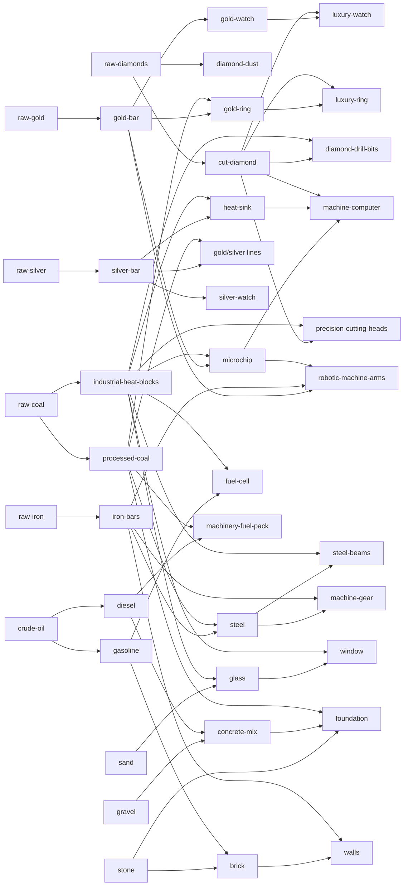

# Economy Balancing Sheet

This is the unified economy workbook for Boardroom Tycoon. It maps every production chain, every item, and every sink that affects cash, resource flow, and payback pacing.

Use this with `docs/economy_balancing_sheet.csv` as the editable balancing surface.

## 1) Core Targets (set these first)

- **T1 building payback:** 3-5 days at reference prices
- **T2 building payback:** 5-8 days
- **T3 building payback:** 8-14 days
- **Bad decision recovery:** 2-4 days for moderate mistakes
- **Upgrade ROI:** each upgrade tier should materially improve throughput but not repay in < 1 day

## 2) Current Global Multipliers / Sinks

- **Building level throughput multiplier:** L1 `1.00`, L2 `1.75`, L3 `2.50`, L4 `3.25`, L5 `4.00`
- **Extractor output multiplier:** L1 `1.00`, L2 `1.10`, L3 `1.20`, L4 `1.30`, L5 `1.40`
- **Upgrade cash base:** `6000` with target-level multipliers `1.0 / 2.0 / 3.5 / 5.5`
- **Prospecting cash cost:** `15000`
- **Starter mine cash cost:** `8000`
- **Buy order fee:** `3.0%`
- **R&D cycle cash base:** `3500` scaling by level

## 3) Building Capex Map (current)

| Building | Cost |
|---|---:|
| Gold Refinery | 60000 |
| Oil Refinery | 62000 |
| Coal Refinery | 54000 |
| Iron Refinery | 58000 |
| Silver Refinery | 61000 |
| Diamond Refinery | 76000 |
| Steel Mill | 70000 |
| Construction Materials Plant | 88000 |
| Fuel Processing Plant | 92000 |
| Gold Processing Plant | 98000 |
| Silver Processing Plant | 102000 |
| Fabrication Plant | 108000 |
| Jewelry Shop | 118000 |
| Diamond Processing Plant | 125000 |
| Tech Plant | 132000 |
| Research & Development | 145000 |
| Material Depot | 74000 |

## 4) Full Recipe Graph (all recipes)

## 5) Recipes Table (inputs, outputs, cycle)

| Recipe ID | Building | Inputs | Outputs | Cycle (min) |
|---|---|---|---|---:|
| refine-gold | Gold Refinery | raw-gold x80, machinery-fuel-pack x10 | gold-bar x80 | 60 |
| refine-oil-gasoline | Oil Refinery | crude-oil x60, machinery-fuel-pack x10 | gasoline x60 | 60 |
| refine-oil-diesel | Oil Refinery | crude-oil x60, machinery-fuel-pack x10 | diesel x60 | 60 |
| refine-coal-processed | Coal Refinery | raw-coal x70, machinery-fuel-pack x10 | processed-coal x70 | 60 |
| refine-coal-heat-blocks | Coal Refinery | raw-coal x70, machinery-fuel-pack x10 | industrial-heat-blocks x35 | 60 |
| refine-iron | Iron Refinery | raw-iron x120, machinery-fuel-pack x10 | iron-bars x120 | 60 |
| refine-silver | Silver Refinery | raw-silver x100, machinery-fuel-pack x10 | silver-bar x100 | 60 |
| refine-diamond-cut | Diamond Refinery | raw-diamonds x40, machinery-fuel-pack x10 | cut-diamond x40 | 60 |
| refine-diamond-dust | Diamond Refinery | raw-diamonds x40, machinery-fuel-pack x10 | diamond-dust x80 | 60 |
| refine-steel | Steel Mill | iron-bars x60, processed-coal x30 | steel x60 | 60 |
| construct-glass | Construction Materials Plant | sand x70, industrial-heat-blocks x10 | glass x70 | 60 |
| construct-bricks | Construction Materials Plant | stone x60, gasoline x20 | brick x60 | 60 |
| construct-concrete | Construction Materials Plant | gravel x60, diesel x20 | concrete-mix x60 | 60 |
| process-diamond-drill-bits | Diamond Processing Plant | cut-diamond x20, industrial-heat-blocks x10 | diamond-drill-bits x10 | 60 |
| process-precision-cutting-heads | Diamond Processing Plant | cut-diamond x20, industrial-heat-blocks x10 | precision-cutting-heads x10 | 60 |
| process-silver-ring | Silver Processing Plant | silver-bar x20, processed-coal x10 | silver-ring x10 | 45 |
| process-silver-watch | Silver Processing Plant | silver-bar x20, processed-coal x10 | silver-watch x5 | 45 |
| process-heatsinks | Silver Processing Plant | silver-bar x30, industrial-heat-blocks x10 | heat-sink x15 | 60 |
| process-gold-ring | Gold Processing Plant | gold-bar x20, processed-coal x10 | gold-ring x10 | 45 |
| process-gold-watch | Gold Processing Plant | gold-bar x20, processed-coal x10 | gold-watch x5 | 45 |
| process-microchip | Gold Processing Plant | gold-bar x20, industrial-heat-blocks x10 | microchip x15 | 60 |
| process-fuel-cells | Fuel Processing Plant | gasoline x30, industrial-heat-blocks x10 | fuel-cell x30 | 45 |
| process-machinery-fuel-packs | Fuel Processing Plant | diesel x30, processed-coal x10 | machinery-fuel-pack x20 | 45 |
| tech-machine-computer | Tech Plant | microchip x10, heat-sink x10, cut-diamond x5 | machine-computer x5 | 60 |
| craft-luxury-ring | Jewelry Shop | gold-ring x5, silver-ring x5, cut-diamond x5 | luxury-ring x5 | 60 |
| craft-luxury-watch | Jewelry Shop | gold-watch x3, silver-watch x3, cut-diamond x5 | luxury-watch x3 | 60 |
| fabricate-steel-beams | Fabrication Plant | steel x30, industrial-heat-blocks x10 | steel-beams x20 | 60 |
| fabricate-machine-gear | Fabrication Plant | steel x20, iron-bars x20 | machine-gear x20 | 60 |
| fabricate-robotic-arm | Fabrication Plant | iron-bars x20, gold-bar x10, microchip x5 | robotic-machine-arms x5 | 60 |
| depot-window | Material Depot | glass x20, industrial-heat-blocks x10 | window x10 | 60 |
| depot-foundation | Material Depot | stone x20, concrete-mix x20, processed-coal x10 | foundation x10 | 60 |
| depot-walls | Material Depot | brick x20, iron-bars x10 | walls x10 | 60 |

## 6) Item Registry Notes (current data quality)

- Items with reference value in `ItemValueCatalog`: many core items are covered.
- Items used in recipes but missing from value catalog: `sand`, `stone`, `gravel`, `window`, `foundation`, `walls`, `precision-cutting-heads`, `diamond-drill-bits`, `machine-computer`.
- Naming mismatch to normalize in sheet:
  - `raw-oil` vs `crude-oil`
  - `raw-stone` vs `stone`
  - `raw-sand` vs `sand`
  - `raw-gravel` vs `gravel`

## 7) Unified Balancing Process

1. Fill missing item reference values.
2. For each recipe, compute:
   - input value
   - output value
   - gross margin per cycle
   - gross margin per day
3. For each building, compute:
   - best recipe margin/day at L1
   - capex payback days (normal/floor/bull scenarios)
4. Tune:
   - recipe IO quantities
   - cycle times
   - building capex
   - upgrade cash/material quantity
5. Re-check all tiers against target payback windows.

## 8) Where to edit numbers in code

- Building prices: `Models/Catalogs/BuildingCatalog.swift`
- Recipe IO and cycle: `Models/Catalogs/RecipeCatalog.swift`
- Upgrade material requirements: `Models/Catalogs/UpgradeCatalog.swift`
- Upgrade cash base: `Services/Buildings/BuildingService.swift`
- Prospecting cost: `Services/Buildings/ProspectingService.swift`
- R&D cash cost: `Services/Buildings/ProductionService.swift`
- Item reference prices (for floor/value baselines): `Models/Catalogs/ItemValueCatalog.swift`

